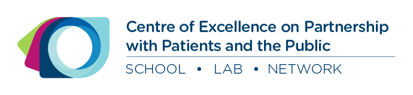

# Bienvenue à la plateforme **Comprendre la recherche**
La plateforme **Comprendre la recherche** a pour but d'aider les gens à comprendre les concepts de base de la recherche. Comprendre les concepts de la recherche est connu sous le nom de **littératie en recherche**. La littératie en recherche établit un langage commun entre les patients, les gestionnaires, les cliniciens et les chercheurs qui peuvent collaborer lors des projets de recherche.

## Qu'est-ce que la littératie en recherche
**La littératie en recherche** est définie comme ayant suffisamment de connaissances pour comprendre les concepts fondamentaux de la recherche (connaissances), pour respecter l'éthique de la recherche (attitude) et pour communiquer avec les chercheurs et les participants de la recherche (comportement). Cette définition est adaptée de Nebeker et López-Arenas (2016).

## À qui s'adresse cette plateforme
**Comprendre la recherche** s'adresse aux patients, aux gestionnaires, aux cliniciens et à toute autre partie prenante intéressée par la recherche et la collaboration avec des chercheurs.

## Objectif de la plateforme
* Aider les parties prenantes à comprendre et à utiliser un langage de recherche commun
* Permettre aux équipes de recherche, aux patients et au public de se préparer pour leurs partenariats
* Guider les équipes de recherche, les patients et le public à travers les étapes importantes de la recherche.
* Permettre aux équipes de recherche, aux patients et au public d'avoir accès à des références externes qui les aideront dans leurs partenariats.

## Comment cette plateforme est-elle organisée
La plateforme est composée de deux éléments : **ce site Web** fournit du contenu textuel sur la littératie en recherche et <a href="https://osf.io/dwy4c/" target="_blank">**un dépôt Open Science Framework (OSF)**</a> qui donne accès aux documents de formation que nous avons élaborés, tous disponibles sous une licence *Creative Commons*. Le dépôt OSF contient également un cahier du participant contenant des renseignements détaillés sur chacun des sujets abordés sur ce site Web.

La plateforme est organisée autour des thèmes suivants :

* **Recherche** : Une introduction à la science, à la recherche et à l'éthique.
* **Revue de littérature** : Une introduction aux types de revues de littérature et des instructions sur la façon de lire les articles de recherche.
* **Méthodologie** : Une description de la recherche qualitative, quantitative et méthodes mixtes ainsi que sur l'approche participative.
* **Application des connaissances** : Une introduction à la synthèse et à la diffusion des connaissances.

 Revues de la littérature > Méthodologie > Application des connaissances" />

<a href="https://osf.io/dwy4c/" target="_blank">**Le dépôt OSF**</a> héberge notre matériel de formation sur la littératie en recherche, y compris :

* Les diapositives PowerPoint des ateliers de littératie en recherche
* Le cahier du participant - <a href="https://osf.io/mwn6t/" target="_blank">Télécharger le cahier</a>
* Les courts vidéos expliquant divers concepts - <a href="https://osf.io/nd6e7/" target="_blank">Visionner les vidéos</a>

## À propos de nous
Cette plateforme est développée par les composantes développements méthodologiques et stratégie de partenariat avec les patients de l’Unité de soutien Stratégie de recherche axée sur le patient (SRAP) du Québec.

La mission de l'**<a href="http://unitesoutiensrapqc.ca/composante/developpements-methodologiques/" target="_blank"> Unité de soutien SRAP du Québec </a>** est de contribuer à répondre aux besoins des patients et des intervenants du réseau de la santé et des services sociaux par des actions concrètes et de bâtir une masse critique d'expertise méthodologique multidisciplinaire adaptée à ces besoins. 

Au sein de l'Unité de soutien SRAP du Québec, on retrouve les composantes **Développements méthodologiques** et **Stratégie de recherche en partenariat avec les patients et le public**. 

La **<a href="http://unitesoutiensrapqc.ca/composante/developpements-methodologiques/" target="_blank">composante Développements méthodologiques</a>** vise à répondre aux besoins des chercheurs, des patients, des cliniciens et des gestionnaires en matière de méthodes avancées (approches méthodologiques et techniques) pour la planification, la réalisation et l'évaluation de la recherche axée sur les patients. 

L'unité **<a href="http://unitesoutiensrapqc.ca/composante/strategie-de-recherche/" target="_blank">Stratégie de partenariat avec les patients et le public </a>** vise à développer des centres d'expertise partout au Québec selon la méthodologie développée par les quatre Réseaux universitaires intégrés de santé et services sociaux (RUISSS) du Québec.  

La Stratégie de recherche axée sur le patient (SRAP) a été élaborée en partenariat avec des chercheurs, des cliniciens, des décideurs, des patients, des membres de différentes communautés et des citoyens. 

## Références
Nebeker C, López-Arenas A. Building research integrity and capacity (BRIC) : an educational initiative to increase research literacy among community health workers and promotores. Journal of Microbiology & Biology Education. 2016 Mar;17(1):41.

## Droits d'auteur et utilisation
Ce produit de connaissance intitulé **Comprendre la recherche** est protégé par le droit d'auteur et appartient aux auteurs.

Ce produit de connaissance est disponible sous **<a href="https://creativecommons.org/licenses/by-nc-sa/4.0/deed.fr" target="_blank">Attribution - Pas d’Utilisation Commerciale - Partage dans les Mêmes Conditions 4.0 International</a>**.

Si vous avez l'intention d'utiliser du matériel de **Comprendre la recherche**, veuillez s.v.p. nous contacter pour nous informer comment vous prévoyez l'utiliser. Cette information est très importante pour nous aider à évaluer son utilisation et son impact. Vous pouvez nous écrire à **supportunit [point] fammed [à] mcgill [point] ca**.

## Politique de confidentialité
Ce site Web, comme de nombreux autres, fait appel aux outils Google Analytics afin d’analyser le comportement des utilisateurs sur <a href="https://comprendrelarecherche.github.io/">**comprendrelarecherche.github.io**</a> et <a href="https://understandingresearch.github.io/">**understandingresearch.github.io**</a>.

Si vous avez des questions concernant la confidentialité de vos données, veuillez nous contacter à **supportunit [point] fammed [à] mcgill [point] ca**

#### A propos de *Google Analytics*
*Google Analytics* est un service d’analyse Web offert par Google. Google collige des données anonymisées recueillies pendant une session de navigation d’un utilisateur, les classe et permet de les visualiser. Il recueille des données notamment sur les habitudes de navigation (y compris les liens sur lesquels l’utilisateur a cliqué et les pages qu’il a visitées), la région d’origine (selon le protocole IP), la source du trafic (p. ex., les sites référents), la langue préférée, le type de navigateur et la taille de l’écran.

Google peut se servir des données recueillies pour contextualiser et personnaliser les annonces diffusées par son propre réseau de publicité.

**Données personnelles colligées :** témoins et données relatives à l’utilisation

**Lieu de traitement :** États-Unis

Pour obtenir de plus amples renseignements, veuillez consulter la <a href="https://policies.google.com/privacy?hl=fr" target="_blank">politique de confidentialité de Google</a>.

## Collaborateurs
Cette initiative est parrainée par <a href="http://unitesoutiensrapqc.ca/composante/developpements-methodologiques/" target="_blank"> Unité de soutien SRAP Québec, Composante développements méthodologiques</a>; le <a href="https://ceppp.ca/fr/" target="_blank">Centre d'excellence sur le partenariat avec les patients et le public (CEPPP)</a>; la <a href="http://unitesoutiensrapqc.ca/composante/strategie-de-recherche/" target="_blank">Stratégie de recherche en partenariat avec les patients et le public</a>, et le <a href="https://www.mcgill.ca/familymed/" target="_blank">Département de médecine de famille de l’Université McGill</a>.

