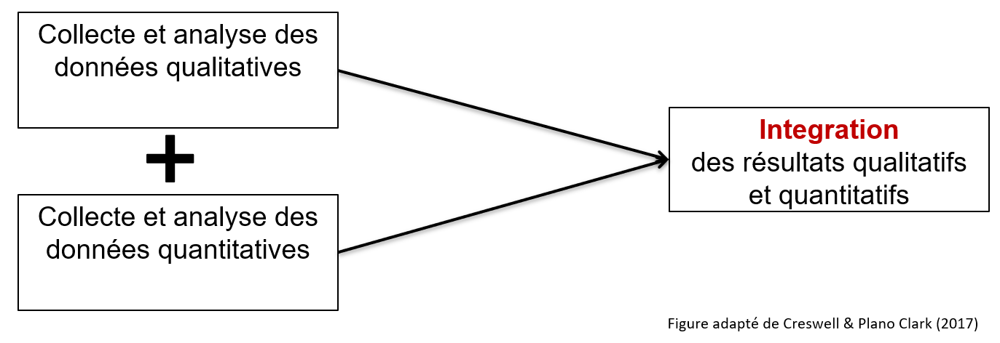
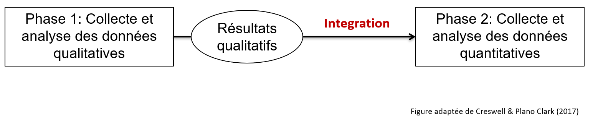
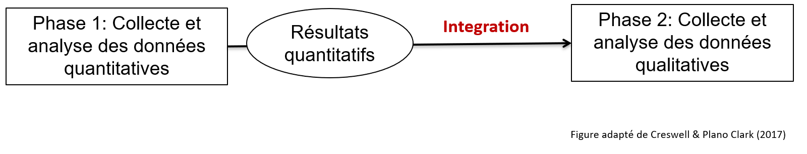

# Recherche utilisant des méthodes mixtes

## Qu’est-ce que la recherche utilisant des méthodes mixtes
La recherche utilisant des méthodes mixtes fait référence à la combinaison et à l'intégration de méthodes qualitatives et quantitatives dans une même étude.

| | |
| ---- | ---- |
| L'intégration | L'intégration qualitative et quantitative dans le processus de collecte et d'analyse des données est essentielle dans les méthodes mixtes (et non la simple juxtaposition de 2 études distinctes). |
| La stratégie | Les méthodes mixtes sont utilisées lorsqu'elles permettent aux chercheurs de mieux répondre à une question de recherche. |

Lorsqu'une méthode qualitative apparaît à côté d'une méthode quantitative dans une étude, il ne s'agit pas nécessairement d'une recherche utilisant les méthodes mixtes. En d'autres termes, la recherche utilisant des méthodes mixtes ne consiste pas en une juxtaposition de méthodes qualitatives et quantitatives distinctes. La recherche utilisant des aux méthodes mixtes cherche plutôt à intégrer des méthodes quantitatives et qualitatives dans la même étude pour répondre à la même question générale de recherche. **L'intégration est donc un élément clé de la recherche utilisant des méthodes mixtes. L'intégration est une valeur ajoutée au point d'interface entre les composantes quantitatives et qualitatives.**

## Quand utiliser des méthodes mixtes
Les méthodes mixtes sont utilisées lorsqu'il faut intégrer des méthodes qualitatives et quantitatives pour mieux répondre aux questions de recherche. Les méthodes mixtes peuvent être choisies pour :

* Interpréter les résultats quantitatifs
* Généraliser statistiquement les résultats qualitatifs
* Explorer (qualitativement) et mesurer (quantitativement) un phénomène

## Devis de recherche
Trois devis de recherche de base sont fréquemment observées en méthodes mixtes.

Devis de recherche | Description | Exemple | 
| ----- | ----- | ----- |
| Le devis convergent | La collecte et l'analyse des données qualitatives et quantitatives sont effectuées séparément, puis les résultats des deux sont comparés ou combinés. | Par exemple, les chercheurs sont intéressés à comprendre les obstacles et les facilitateurs de la mise en œuvre d'un nouveau programme. Pour atteindre cet objectif, ils décident de mener une enquête auprès des participants (quantitative) et des entrevues avec les cliniciens (qualitative). Ensuite, ils comparent les résultats obtenus par chaque méthode.  |
| Devis séquentiel exploratoire | Dans ce devis, la première phase est qualitative. Les résultats qualitatifs éclairent la collecte des données de la deuxième phase, qui est quantitative. | Ce devis peut être utilisé pour développer un outil de mesure.  Par exemple, des entrevues seront menées pour dresser une liste d'éléments jugés importants par les experts et créer une première version de l'outil de mesure. Ensuite, une étude quantitative est menée pour étudier les propriétés psychométriques de cet outil (p. ex., analyse factorielle). |
| Devis séquentiel explicatif | Dans ce devis, la première phase est quantitative. Les résultats quantitatifs éclairent la collecte de données de la deuxième phase qui est qualitative. | Par exemple, une étude quantitative est menée pour étudier l'efficacité d'une intervention. Ensuite, une étude qualitative est menée pour expliquer pourquoi l'intervention n'a pas fonctionné pour certains participants. |

### Devis convergent

*Au-dessus : Figure du devis convergent*

### Devis séquentiel exploratoire
 Résultats qualitatifs > Intégration > Phase 2 : Collecte et analyse de données quantitatives. Figure adaptée de l'ouvrage de référence de Creswell & Plano Clark (2017)." width="75%" />

*Au-dessus : Figure du devis séquentiel exploratoire*.

### Devis séquentiel explicatif
 Résultats quantitatifs > Intégration > Phase 2 : Collecte et analyse de données qualitatives. Figure adaptée de l'ouvrage de référence de Creswell & Plano Clark (2017)." width="75%" />

*Au-dessus : Figure du devis séquentiel explicatif*.

## Avantages et défis de la recherche utilisant des méthodes mixtes
Avantages | Défis |
| ----- | ----- |
| Les forces de chaque type de méthode peuvent compenser les limites de l'autre. | Le processus de recherche peut être complexe et exiger plus de temps et de ressources qu'en utilisant une seule méthode. |
| Les méthodes mixtes permettent une compréhension plus complète et plus approfondie du phénomène étudié qu'une approche quantitative ou qualitative seule. | Ces méthodes nécessitent une formation et un équipement supplémentaires (p. ex., logiciels spécialisés). |

La recherche quantitative donne habituellement accès à des mesures, des descriptions généralisables, et des tendances générales (p. ex., analyses statistiques sur un grand groupe de personnes). 

La recherche qualitative donne généralement accès à une compréhension plus approfondie des phénomènes complexes dans un contexte spécifique (p. ex. des entrevues individuelles pour comprendre les phénomènes complexes). 

En combinant les deux, la recherche utilisant les méthodes mixtes peut potentiellement compenser les limites de chaque méthode pour comprendre un phénomène dans ses aspects généraux et spécifiques. 

Les méthodes mixtes intégrent les forces des méthodes qualitatives et quantitatives, et permettent de mieux expliquer la complexité d'un phénomène. Toutefois, cela exige que les chercheurs ou les membres des équipes de recherche aient une expertise en méthodes qualitatives et quantitatives.

**Merci de nous aider à améliorer cette section en complétant <a href="https://forms.gle/atwkEt88wTSpHWYv9" target="_blank">un court questionnaire</a>.**

## Ressources supplémentaires
* **<a href="https://www.youtube.com/watch?v=1OaNiTlpyX8" target="_blank">What is mixed methods research?</a>** : Vidéo YouTube de John Creswell (15 minutes; en anglais)
