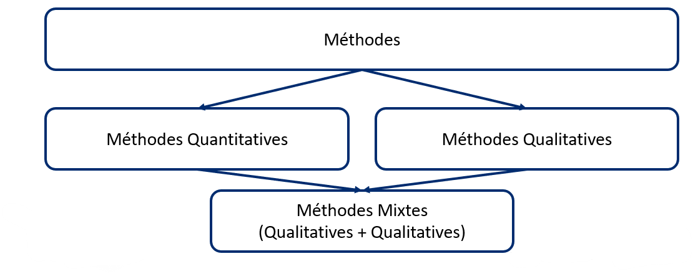

# Méthodologie
Il existe trois principaux types de méthodes de recherche (<a href="https://osf.io/8sqkt/" target="_blank" >visionnez notre vidéo de 4 minutes</a>) :

* [Quantitative](methodologie/recherche_quantitative_fr.md)
* [Qualitative](methodologie/recherche_qualitative_fr.md)
* [Méthodes mixtes](methodologie/methodes_mixtes_fr.md)

[La recherche participative](methodologie/recherche_participative_fr.md) est une approche de recherche dans laquelle les communautés ou organisations qui peuvent bénéficier de la recherche collaborent en tant que partenaires de recherche. Tout type d'étude de recherche peut être participatif.

 Pour en savoir plus, explorez notre <a href="https://osf.io/7vypr/" target="_blank">glossaire de termes utilisés in recherche</a> (PDF téléchargeable).

*Au-dessus : Diagramme des types de méthodes de recherche*.

