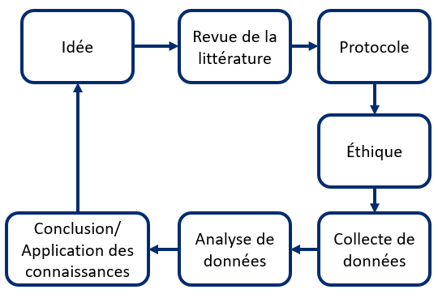

# Recherche

## Qu'est-ce que la science et la recherche

La science est un examen rigoureux du monde qui nous entoure. La science consiste à poser des questions, à faire des observations et à évaluer les idées qui en découlent. En d'autres termes, la science vise à poser des questions de recherche et à concevoir des études qui peuvent répondre à ces questions. 
**La science est systématique, transparente, explicite et reproductible.**

Il existe plusieurs définitions de la recherche. Celle de Creswell (2002, p. 3) est la suivante : **La recherche est un « processus utilisé pour recueillir et analyser des renseignements afin d'accroître notre compréhension d'un sujet ou d'un enjeu »**.

 Pour en savoir plus, explorez notre <a href="https://osf.io/7vypr/" target="_blank">glossaire de termes utilisés en recherche</a> (PDF téléchargeable).

Les deux types de recherche dont on entend souvent parler sont la recherche fondamentale et la recherche appliquée.

Recherche fondamentale | Recherche appliquée |
| ------------- |-------------|
| Conduite pour faire progresser les connaissances sur les fondements des phénomènes sans envisionner une application. Il s'agit parfois d'une recherche en laboratoire ou sur banc d'essai. | Se concentre sur l'analyse et la résolution de problèmes réels (p. ex. étudier l'efficacité d'un médicament). |

## Recherche axée sur le patient
Un **patient** est une personne qui a une expérience personnelle d'un problème de santé, y compris les aidants naturels. L'un des principaux centres d'intérêt des <a href="https://cihr-irsc.gc.ca/f/193.html" target="_blank">Instituts de recherche en santé du Canada (IRSC)</a> au cours des dernières années est **la recherche axée sur le patient**.

**La recherche axée sur le patient:**

* Mobilise les patients, leurs soignants et leur famille en tant que partenaires,
* Cible les priorités identifiées par les patients afin d'améliorer leur santé,
* Est dirigée par des équipes multidisciplinaires en partenariat avec différentes parties prenantes,
* Vise à appliquer les connaissances générées pour améliorer les systèmes et les pratiques de soins de santé.

><a href="http://www.cihr-irsc.gc.ca/f/41204.html" target="_blank">« La recherche axée sur le patient a pour but de mobiliser les patients, les soignants et les familles à titre de partenaires dans le processus de recherche. Cet engagement aide à garantir que les études sont axées sur les priorités établies par les patients, ce qui débouche sur de meilleurs résultats pour les patients. »  (Instituts de recherche
en santé du Canada)</a>

## Vue générale des étapes de la recherche
Tout projet de recherche, incluant les projets de recherche axé sur le patient, comprend un problème de recherche, des lacunes dans les connaissances, des objectifs, des questions et des méthodes. Les principales étapes sont les suivantes :

1. Une revue de la littérature est effectuée pour découvrir les lacunes dans les connaissances. Ces lacunes dans les connaissances orientent les objectifs et les questions de recherche. 
1. Avant que le projet puisse commencer, il doit recevoir l'approbation éthique d'un ou plusieurs centres institutionnels d’éthique de la recherche concernés. 
1. Les données sont recueillies et analysées à l'aide d'une ou plusieurs méthodes de recherche appropriées (qualitative, quantitative ou méthodes mixtes) pour produire des résultats. 
1. Ces résultats sont interprétés, communiqués ou appliqués par les parties prenantes à l'étape de l'application des connaissances.

 Revue de la littérature > Protocole > Éthique > Collecte de données > Analyse des données > Conclusion/application des connaissances" width="50%" />

*Au-dessus : Aperçu général des étapes de la recherche*.

**Merci de nous aider à améliorer cette section en complétant <a href="https://forms.gle/GgXRb8fRp4qbAqVs8" target="_blank">un court questionnaire</a>.**

## Éthique de la recherche
L'éthique constitue des normes de conduite qui distinguent et définissent les comportements qui sont acceptables et ceux qui ne le sont pas. Différentes disciplines, professions et organisations ont des normes de conduite qui correspondent à leurs besoins et leurs objectifs. L'éthique de la recherche correspond aux principes et aux normes qui tentent de prévenir l'inconduite (p. ex., fabrication, falsification ou fausse déclaration de données de recherche) et protègent les participants à la recherche.

### Contexte historique
La recherche impliquant des êtres humains fait partie de la médecine depuis longtemps. Toutefois, elle a véritablement émergé au XIXe siècle avec le développement de la méthode expérimentale, c’est-à-dire de tester des hypothèses (idées) sur des cellules, humains ou animaux. L’idée d’effectuer des recherches avec des êtres humains est devenue plus acceptable au début du XXe siècle bien que la plupart des études furent d’abord réalisées sur des animaux. Malheureusement, la recherche médicale en Amérique du Nord et en Europe à la fin du XIXe et au début du XXe siècle, notamment sur les maladies infectieuses, a inclus des pratiques moralement condamnables. Même si certaines associations médicales et scientifiques ont dénoncé ces pratiques, cela n’a pas donné lieu à des accusations professionnelles, disciplinaires ou criminelles. C’est uniquement après la Seconde Guerre mondiale et le procès de Nuremberg que de telles accusations furent portées. Le verdict des juges en 1947 comprenait une section intitulée « Expériences médicales admissibles », dans laquelle dix principes à suivre pour effectuer des recherches sur les êtres humains sont décrits. Ces principes constituent le « Code de Nuremberg » dont le premier stipule que « le consentement volontaire du sujet humain est absolument essentiel ». Ce Code est un document fondateur de l’éthique de la recherche et est encore utilisé de nos jours. 

### Contexte canadien
Une mesure clé pour assurer l’acceptabilité sur le plan éthique d’un projet de recherche consiste à obtenir une évaluation indépendante, c’est-à-dire par une autre personne que le chercheur principal et les co-chercheurs. La première exigence canadienne en ce qui a trait à l’évaluation indépendante de protocoles par un comité d’éthique de la recherche (CÉR) était incluse dans les lignes directrices émises en 1978 par le Conseil de recherches médicales (CRM). En 1998, les Instituts de recherche en santé du Canada (IRSC) ainsi que deux autres conseils fédéraux, le Conseil de recherches en sciences naturelles et en génie (CRSNG) et le Conseil de recherches en sciences humaines (CRSH), ont publié conjointement un ensemble unique de lignes directrices, **l’Énoncé de politique des trois Conseils : Éthique de la recherche avec des êtres humains (EPTC)**, pour réguler les travaux sur les êtres humains dans tous les domaines scientifiques au Canada. 

<a href="http://ethics.gc.ca/fra/policy-politique_tcps2-eptc2_2018.html" target="_blank">L'Énoncé de politique des trois conseils : Éthique de la recherche avec des êtres humains – EPTC 2 (2018)</a> réglemente la recherche avec des êtres humains dans tous les domaines scientifiques. Cette politique considère les principes éthiques comme l'expression de la valeur primordiale de la dignité humaine et une « boussole » pour fournir les protections nécessaires aux participants à la recherche tout en répondant aux besoins légitimes de la recherche. 

### Comité d'éthique de la recherche (CÉR)
Étant donné que les chercheurs ne peuvent plus évaluer seuls l'acceptabilité éthique de leurs projets de recherche, ce mandat est confié à un **Comité d'éthique de la recherche (CÉR)**. Un CÉR est chargé d'évaluer et d'approuver chaque année tout projet de recherche avec des êtres humains. Les CÉR sont habituellement composés de chercheurs, d'éthiciens, d'avocats et de membres du public. Le mandat principal d'un CÉR d’un établissement (p. ex., université, hôpital) est la protection, la sécurité et le bien-être de tous les participants humains impliqués dans des recherches menées sous la responsabilité de l'institution.

**Merci de nous aider à améliorer cette section en complétant <a href="https://forms.gle/BYCMk2fhV77HfP8A9" target="_blank">un court questionnaire</a>.**

## Références
Creswell JW. Educational research : Planning, conducting and evaluating quantitative and qualitative research. Upper Saddle River, NJ : Prentice Hall ; 2002.

## Ressources supplémentaires
* **<a href="https://www.praticsante.chaire.ulaval.ca/wp-content/uploads/2020/02/Guide_PPP_MAN_PNS_MP_F-compress%C3%A9-2.pdf" target="_blank">Guide Patient-Citoyen Partenaire en Recherche</a>**: <a href="http://unitesoutiensrapqc.ca/" target="_blank">L'Unité de soutien SRAP du Québec</a> offre un guide s'adressant aux patients-citoyens qui voudraient participer à la recherche en santé. Le guide présente les bases de la recherche axée sur le patient, dans le but de préparer les patients à leurs partenariats de recherche.

* **<a href="https://osf.io/7vypr/" target="_blank">Glossaire de termes utilisés en recherche</a>**: un glossaire developpé par la <a href="https://soutiensrapmetho.ca/" target="_blank">composante Développements méthodologiques</a> qui fournit des définitions pour les termes de recherche fréquemment utlisés.

* **<a href="http://cihr-irsc.gc.ca/f/documents/cihr_jargon_buster-fr.pdf" target="_blank">Explication du jargon - termes de recherche en santé</a>** : un glossaire élaboré par les IRSC qui fournit des définitions en langage courant des termes fréquemment utilisés dans la recherche en santé.

* **<a href="https://www.nccmt.ca/fr/developpement-des-capacites/videos" target="_blank">Centre de collaboration nationale des méthodes et outils (CCNMO)</a>** : vidéos sur les concepts clés liés aux données probantes de la recherche et à la santé publique fondée sur des données probantes de l'un des six Centres de collaboration nationale en santé publique au Canada.

* **<a href="https://www.research4life.org/fr/training/" target="_blank">Research4Life portail de formation</a>** : une plateforme avec des ressources téléchargeables gratuitement pour les chercheurs. La section Compétences en rédaction comprend 10 modules, dont la lecture et l'écriture d'articles scientifiques, la propriété intellectuelle et la bibliographie sur le Web, ainsi que des cahiers d'activités pratiques.

* **<a href="https://www.canada.ca/fr/sante-canada/services/science-recherche/avis-scientifiques-processus-decisionnel/comite-ethique-recherche/ressources-matiere-ethique.html" target="_blank">Ressources en matière d'éthique</a>** : une liste de ressources de Santé Canada et du Comité d'éthique de la recherche de l'Agence de santé publique du Canada (ASPC) 
